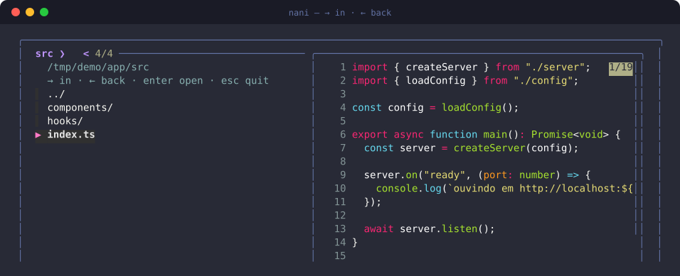
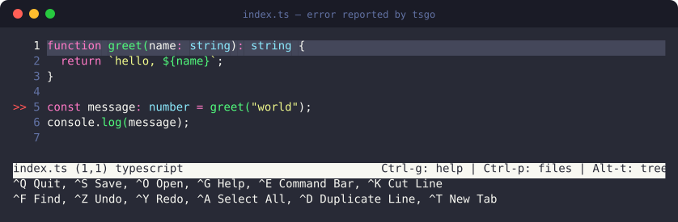
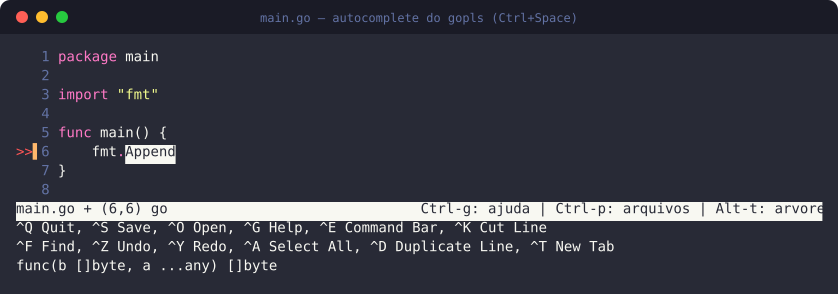

<div align="center">

# nani

**Navegador de pastas e editor de terminal com LSP de verdade — sem virar um Neovim.**

[](https://github.com/JohnnyBoySou/nani/releases)
[](https://go.dev)
[](https://github.com/JohnnyBoySou/nani/releases)
[](https://github.com/JohnnyBoySou/nani/releases)



</div>

## A ideia

Listar as pastas, escolher uma, escolher um arquivo, editar, voltar para a lista.
Nada de modo normal, modo inserção, `:wq` ou meia hora de configuração.

O editor é o [micro](https://micro-editor.github.io/): `Ctrl+S` salva, `Ctrl+Q`
sai, `Ctrl+C`/`Ctrl+V` copiam e colam, as setas andam pelo texto, e a barra de
atalhos fica fixa no rodapé — os mesmos reflexos do nano, com o que o nano nunca
teve.

> **Por que não o nano?** Ele não suporta LSP. Não tem sistema de plugins nem
> canal de comunicação com um language server — só realce de sintaxe por regex.
> Autocomplete, ir para a definição e erro sublinhado na hora não são possíveis
> nele, por mais `.nanorc` que se escreva.

## O editor

Erro de tipo apontado na linha, direto do `tsgo` — o TypeScript reescrito em Go:



Autocomplete com assinatura da função, vindo do `gopls`:



## Instalação

Baixe o binário da [última release](https://github.com/JohnnyBoySou/nani/releases)
e rode o setup:

```bash
chmod +x nani-linux-amd64
./nani-linux-amd64 setup
```

O setup copia o próprio binário para `~/.local/bin/nani` — daí em diante o comando
é só `nani`, de qualquer pasta. Ele é idempotente: rodar de novo só preenche o que
falta.

| o quê | onde |
| --- | --- |
| o próprio `nani` | `~/.local/bin/nani` |
| micro (binário estático da última release) | `~/.local/bin/micro` |
| plugins `lsp`, `filemanager`, `fzf`, `detectindent`, `editorconfig` | `~/.config/micro/plug/` |
| `gopls` (via `go install`) | `~/go/bin/gopls` |
| `tsgo` (via `npm`, em prefixo próprio) | `~/.local/lib/tsgo` + link em `~/.local/bin/tsgo` |
| `settings.json` e `bindings.json` | `~/.config/micro/` |

O `tsgo` vai para um prefixo separado de propósito: não mexe nos pacotes globais
de npm da máquina.

Preferindo compilar:

```bash
go build -o ~/.local/bin/nani .
```

## Uso

```bash
nani            # navega a partir da pasta atual (ou de ~/work, se chamado do home)
nani ~/projetos # navega a partir de uma pasta específica
```

`Enter` entra na pasta e depois abre o arquivo. `Esc` na lista de arquivos volta
para as pastas; `Esc` nas pastas encerra. Ao fechar o editor você cai de volta na
lista, pronto para o próximo arquivo.

Com `fzf` instalado a busca é fuzzy e com preview — `bat` para arquivos, `eza`
para árvores de pasta. Sem `fzf`, cai num seletor numerado que funciona em
qualquer lugar.

### Ele respeita o seu `.gitignore`

Dentro de um repositório, a listagem é a mesma que o git enxerga: `node_modules`,
`dist`, `.next`, `*.log` e o que mais estiver ignorado simplesmente não aparece —
nem na lista, nem no preview. Quem decide é o `.gitignore` do projeto, mais o
`.git/info/exclude` e o seu gitignore global.

Fora de um repositório, vale uma lista fixa de pastas que nunca interessam
(`node_modules`, `vendor`, `dist`, `build`, `target`, `.venv`, …).

### Atalhos no editor

| tecla | ação |
| --- | --- |
| `Ctrl+S` / `Ctrl+Q` | salvar / sair |
| `Ctrl+Space` | autocomplete do LSP |
| `Alt+k` | hover — tipo, assinatura, documentação |
| `Alt+d` ou `Alt+g` | ir para a definição |
| `Alt+r` | referências |
| `Alt+f` | formatar (também roda ao salvar) |
| `Ctrl+p` | abrir arquivo por nome |
| `Alt+t` | árvore de arquivos lateral |

## Como o LSP funciona aqui

O plugin LSP do micro só entende diagnósticos **push**
(`textDocument/publishDiagnostics`). O `tsgo` entrega por **pull**
(`textDocument/diagnostic`) e ainda fica bloqueado esperando respostas a requests
que o plugin não responde. Sem uma ponte, o resultado é um editor em silêncio:
nenhum erro aparece e nada indica o porquê.

Por isso o `nani` embute um proxy LSP, que sobe entre o editor e o servidor:

```
micro  ──stdio──>  nani lsp  ──stdio──>  gopls / tsgo
```

Ele faz três coisas que o plugin não faz:

1. **Responde aos requests do servidor** — `workspace/configuration` e
   `client/registerCapability`. É o que destrava o `tsgo`, que espera por eles
   antes de responder qualquer outra coisa.
2. **Anuncia as capabilities de pull** que o editor não anuncia, injetando-as no
   `initialize`.
3. **Converte pull em push** — a cada `didOpen`, `didChange` ou `didSave`, pede
   `textDocument/diagnostic` e publica a resposta como `publishDiagnostics`, que
   o plugin sabe desenhar.

O `gopls` passa pelo mesmo caminho. Servidor que não suporte pull responde erro, e
nesse caso a ponte preserva os diagnósticos que ele já mandou por push, em vez de
apagá-los com uma lista vazia.

### O editor abre na raiz do projeto

O plugin usa o diretório de trabalho do editor como `rootUri`. Aberto de dentro de
um subdiretório, `gopls` e `tsgo` não resolvem os imports. Então o `nani` sobe a
partir do arquivo até achar `go.mod`, `go.work`, `package.json`, `tsconfig.json`,
`deno.json` ou `.git`, e abre o editor a partir dali.

## Quando algo não funcionar

O proxy grava log se você apontar um caminho:

```bash
NANI_LSP_LOG=/tmp/nani-lsp.log nani
```

O log mostra o handshake, os requests respondidos e quantos diagnósticos vieram
em cada consulta:

```
proxy iniciado: tsgo --lsp -stdio
initialize do cliente, capabilities de pull injetadas
respondendo request do servidor: workspace/configuration
respondendo request do servidor: client/registerCapability
-> pedindo diagnósticos de file:///.../index.ts (id nani-diag-1)
<- 1 diagnóstico(s) para file:///.../index.ts
```

Nenhum diagnóstico aparecendo costuma ser uma destas causas:

- **o arquivo está fora de um projeto** — sem `go.mod` ou `tsconfig.json` por
  perto, o servidor não monta o workspace;
- **`typescript` 7 instalado como global do npm** — o `typescript-language-server`
  procura `lib/tsserver.js`, que não existe mais no pacote da versão 7. O `nani`
  usa o `tsgo` justamente para não depender disso;
- **binário fora do PATH** — confira `which gopls tsgo micro`.

## Variáveis

| variável | efeito |
| --- | --- |
| `NANI_EDITOR` | editor a abrir, no lugar do micro |
| `NANI_LSP_LOG` | caminho do log do proxy LSP |

## Estrutura

```
main.go      subcomandos da CLI
browser.go   navegação, listagem respeitando o .gitignore e abertura do editor
lsp.go       ponte LSP: pull -> push e respostas aos requests do servidor
setup.go     instalação do editor, plugins, language servers e configuração
docs/        as capturas acima, geradas a partir de telas reais do terminal
```
